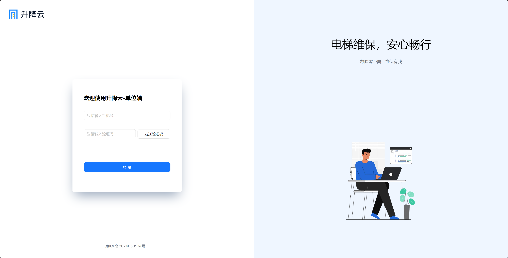
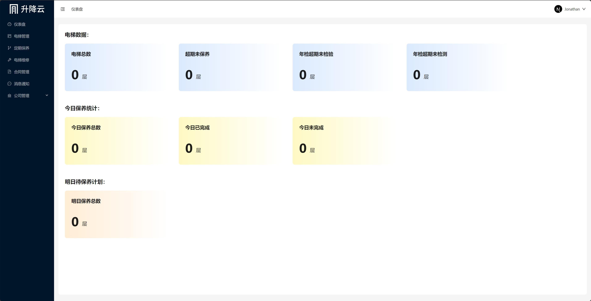

# Project - Lifthub

## Tech Stack

    1. React18
    2. Next14
    3. Tailwindcss
    4. Ant Design
    5. Alibaba Cloud

## Introduction

Elevator Management Platform, including a platform end, an enterprise end, and a maintenance personnel end. After the enterprise registration, the elevator maintenance needs are released at the enterprise end. The platform end is responsible for enterprise registration review and order dispatch circulation. Maintenance personnel receive orders through the mobile app.

## Presentation

- 
- 

## Demo

- http://org.lifthub.cn/
- http://platform.lifthub.cn/
