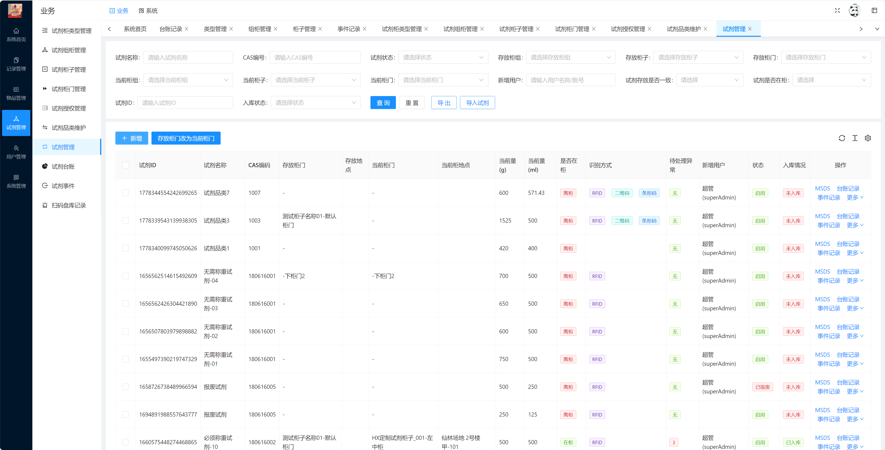

# Project - Campus Laboratory Smart Cabinet Management System(PC)

## Tech Stack

    1. Vue3
    2. Vuex
    3. ElementUI
    4. scss
    5. Java
    6. Spring

## Introduction

a comprehensive solution designed to streamline the management of chemical reagents, lab equipment, and material borrowing records. Key features include automatic inventory tracking, borrowing history, risk reporting, and stock management, providing a powerful tool for optimized and efficient laboratory operations.

## Presentation

- 

## Demo

- https://140.143.202.23:9001/chem
