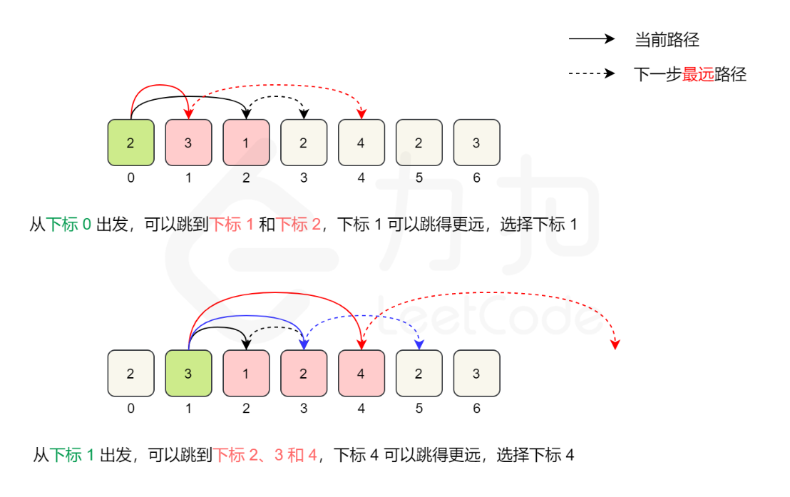

## 605. Can Place Flowers
You have a long flowerbed in which some of the plots are planted, and some are not. However, flowers cannot be planted in adjacent plots.
Given an integer array flowerbed containing 0's and 1's, where 0 means empty and 1 means not empty, and an integer n, return true if n new flowers can be planted in the flowerbed without violating the no-adjacent-flowers rule and false otherwise.
- Example 1: 
  - Input: flowerbed = [1,0,0,0,1], n = 1 
  - Output: true
- Example 2: 
  - Input: flowerbed = [1,0,0,0,1], n = 2 
  - Output: false

```js
class Solution {
    public boolean canPlaceFlowers(int[] flowerbed, int n) {
        int len = flowerbed.length;
        for(int i = 0; i < len && n > 0;) {
            // 当前已经种了花, 后移两个单位
            // 因为题目说了，原数组满足不相邻原则
            if(flowerbed[i] == 1) {
                i += 2;
                continue;
            } 
            // 边界值判断，是否最后一个位置
            // 最后一个位置可种，直接种上
            if(i == len - 1) {
                i += 2;
                n --;
                continue;
            }
            // 判断后一个位置是否已种？
            // 为什么不需要判断前面是否已种(根据题意是不可能的)
            if(flowerbed[i + 1] == 0) {
               i += 2;
               n --;
               continue;
            } 
            // 如果当前位置是0,但是不可种
            // 说明后一个位置是1，那得向后移动3个单位
            i += 3;
        }
        return n <= 0; // 等于0也可以
    }
}
```

## 122. Best Time to Buy and Sell Stock II
You are given an integer array prices where prices[i] is the price of a given stock on the i(th) day.
On each day, you may decide to buy and/or sell the stock. You can only hold at most one share of the stock at any time. However, you can buy it then immediately sell it on the same day.
Find and return the maximum profit you can achieve.
- Example 1:
  - Input: prices = [7,1,5,3,6,4]
  - Output: 7
  - Explanation: Buy on day 2 (price = 1) and sell on day 3 (price = 5), profit = 5-1 = 4. Then buy on day 4 (price = 3) and sell on day 5 (price = 6), profit = 6-3 = 3. Total profit is 4 + 3 = 7.
- Example 2:
  - Input: prices = [1,2,3,4,5]
  - Output: 4
  - Explanation: Buy on day 1 (price = 1) and sell on day 5 (price = 5), profit = 5-1 = 4. Total profit is 4.
- Example 3:
  - Input: prices = [7,6,4,3,1]
  - Output: 0
  - Explanation: There is no way to make a positive profit, so we never buy the stock to achieve the maximum profit of 0.
```js
class Solution {
    public int maxProfit(int[] prices) {
        int result = 0;
        for(int i = 1; i < prices.length; i++) {
            // 当天的价格减去前一天的价格，获得当天的利润
            int profit = prices[i] - prices[i - 1];
            // 如果当天有利润，那就买
            if(profit > 0) result += temp;
        }
        return result;
    }
}
```

## 53. Maximum Subarray
Given an integer array nums, find the subarray with the largest sum, and return its sum.
- Example 1:
  - Input: nums = [-2,1,-3,4,-1,2,1,-5,4]
  - Output: 6
  - Explanation: The subarray [4,-1,2,1] has the largest sum 6.
- Example 2:
  - Input: nums = [1]
  - Output: 1
  - Explanation: The subarray [1] has the largest sum 1.
- Example 3:
  - Input: nums = [5,4,-1,7,8]
  - Output: 23
  - Explanation: The subarray [5,4,-1,7,8] has the largest sum 23.
```js
class Solution {
    // 定义一个极小值
    int result = Integer.MIN_VALUE;
    // 采集当前连续和
    int sum = 0;
    public int maxSubArray(int[] nums) {
        for(int i = 0; i < nums.length; i ++) {
            // 采集当前连续和
            sum += nums[i];
            // 如果当前连续和大于result
            // 覆盖result
            if(sum > result) result = sum;
            // 如果当前连续和小于0, 置0，重新累加
            // 为什么这么判断？
            // 1. 如果数组中有大于等于0的值，负数就得立刻放弃
            // 2. 如果数组中全为负数，那比较的就是每一个值
            if(sum < 0) sum = 0;
        }
        return result;
    }
}
```

## 455. Assign Cookies
Assume you are an awesome parent and want to give your children some cookies. But, you should give each child at most one cookie.
Each child i has a greed factor g[i], which is the minimum size of a cookie that the child will be content with; and each cookie j has a size s[j]. If s[j] >= g[i], we can assign the cookie j to the child i, and the child i will be content. Your goal is to maximize the number of your content children and output the maximum number.
- Example 1:
  - Input: g = [1,2,3], s = [1,1] 
  - Output: 1
  - Explanation: You have 3 children and 2 cookies. The greed factors of 3 children are 1, 2, 3. And even though you have 2 cookies, since their size is both 1, you could only make the child whose greed factor is 1 content. You need to output 1.
- Example 2:
  - Input: g = [1,2], s = [1,2,3] 
  - Output: 2
  - Explanation: You have 2 children and 3 cookies. The greed factors of 2 children are 1, 2. You have 3 cookies and their sizes are big enough to gratify all of the children, You need to output 2.
```js title="Solution 1"
class Solution {
    public int findContentChildren(int[] g, int[] s) {
        // 排序胃口
        Arrays.sort(g);
        // 排序饼干大小
        Arrays.sort(s);
        // 可以满足的人数
        int result = 0;
        // 胃口index
        int gIndex = 0;
        // 循环饼干数组，从小到大
        for (int i = 0; i < s.length; i++) {
            // 边界1: 胃口index不能越界
            // 边界2: 当前饼干可以满足当前小朋友
            if(gIndex < g.length && s[i] >= g[gIndex]) {
                gIndex ++;// 瞒住了胃口，胃口后移动一位
                result ++;
            }
        }
        return result;
    }
}
```

## Solution2
```js
class Solution {
    public int findContentChildren(int[] g, int[] s) {
        Arrays.sort(g);
        Arrays.sort(s);
        int result = 0;
        int gIndex = 0;
        int sIndex = 0;
        while(gIndex < g.length && sIndex < s.length) {
            // 饼干能够满足胃口
            if(s[sIndex] >= g[gIndex]) {
                // 同时后移
                gIndex ++;
                result ++;
            }
            // 不管能不能满足，饼干用完都得后移
            sIndex ++;
        }
        return result;
    }
}
```

## 881. Boats to Save People
You are given an array people where people[i] is the weight of the i(th) person, and an infinite number of boats where each boat can carry a maximum weight of limit. Each boat carries at most two people at the same time, provided the sum of the weight of those people is at most limit.
Return the minimum number of boats to carry every given person.
- Example 1:
  - Input: people = [1,2], limit = 3
  - Output: 1
  - Explanation: 1 boat (1, 2)

- Example 2:
  - Input: people = [3,2,2,1], limit = 3
  - Output: 3
  - Explanation: 3 boats (1, 2), (2) and (3)

- Example 3:
  - Input: people = [3,5,3,4], limit = 5
  - Output: 4
  - Explanation: 4 boats (3), (3), (4), (5)
```js
class Solution {
    public int numRescueBoats(int[] people, int limit) {
        int boats = 0;
        int left = 0;
        int right = people.length - 1;
        // 排序 [3,2,2,1] => [1,2,2,3]
        Arrays.sort(people);
        while(left <= right) {
            // 如果左右相加重量不大于limit，一起上
            if(people[left] + people[right] <= limit){
                left ++;
                right --;
                boats ++;
            }else { // 否则重的先上
                boats ++;
                right --;
            }
        }
        return boats;
    }
}
```

## 435. Non-overlapping Intervals
Given an array of intervals intervals where intervals[i] = [start(i), end(i)], return the minimum number of intervals you need to remove to make the rest of the intervals non-overlapping.
- Example 1:
  - Input: intervals = [[1,2],[2,3],[3,4],[1,3]]
  - Output: 1
  - Explanation: [1,3] can be removed and the rest of the intervals are non-overlapping.
- Example 2:
  - Input: intervals = [[1,2],[1,2],[1,2]]
  - Output: 2
  - Explanation: You need to remove two [1,2] to make the rest of the intervals non-overlapping.
- Example 3:
  - Input: intervals = [[1,2],[2,3]]
  - Output: 0
  - Explanation: You don't need to remove any of the intervals since they're already non-overlapping.
```js
class Solution {
    public int eraseOverlapIntervals(int[][] intervals) {
        int count = 0;
        if(intervals.length <= 1) return 0;
        // 这里不能按照区间升序排序，如下情况
        // 那么答案是2，显然不对
        // |_________|                 区间a
        //   |___|                     区间b
        //          |__|               区间c
        //                |______|     区间d
        // 所以只能按照结束区间升序排序,答案是3
        //   |___|                     区间b
        // |_________|                 区间a
        //          |__|               区间c
        //                |______|     区间d
        // 第一个区间结束的越早，留给后面的机会越多!!!
        Arrays.sort(intervals, (a, b) -> a[1] - b[1]);
        // 取第一个的结束区间
        int end = intervals[0][1];
        for(int i = 1; i < intervals.length; i++) {
            int[] arr = intervals[i];
            if(arr[0] < end) count ++; // 重合了，当前区间需要删除，计数+1
            else end = arr[1]; // 否则不重合，结束区间后移
        }
        return count;
    }
}
```

## 55. Jump Game
You are given an integer array nums. You are initially positioned at the array's first index, and each element in the array represents your maximum jump length at that position.
Return true if you can reach the last index, or false otherwise.
- Example 1:
  - Input: nums = [2,3,1,1,4]
  - Output: true
  - Explanation: Jump 1 step from index 0 to 1, then 3 steps to the last index.
- Example 2:
  - Input: nums = [3,2,1,0,4]
  - Output: false
  - Explanation: You will always arrive at index 3 no matter what. Its maximum jump length is 0, which makes it impossible to reach the last index.
```js
class Solution {
    public boolean canJump(int[] nums) {
        // 如果数组为空或者只有一个元素
        // 因为约束条件是数组的值大于等于0
        // 所以在第一个位置不需要跳，就是终点
        if(nums.length <= 1) return true;
        // 覆盖范围
        int cover  = 0;
        // 开始扩大范围
        for(int i = 0; i <= cover; i++) {
            // 每次当前位置加上他的步长，获得新的覆盖范围
            // 如果覆盖范围已经大于或等于最后一个位置,代表能够到达
            if(cover >= nums.length - 1) return true;
            // 每次判断取最大的覆盖范围
            cover = Math.max(nums[i] + i, cover);
        }
        return false;
    }
}
```

## 45. Jump Game II
You are given a 0-indexed array of integers nums of length n. You are initially positioned at nums[0].
Each element nums[i] represents the maximum length of a forward jump from index i. In other words, if you are at nums[i], you can jump to any nums[i + j] where:
- 0 <= j <= nums[i] and
- i + j < n
Return the minimum number of jumps to reach nums[n - 1]. The test cases are generated such that you can reach nums[n - 1].
- Example 1:
  - Input: nums = [2,3,1,1,4]
  - Output: 2
  - Explanation: The minimum number of jumps to reach the last index is 2. Jump 1 step from index 0 to 1, then 3 steps to the last index.
- Example 2:
  - Input: nums = [2,3,0,1,4]
  - Output: 2
    
    
```js
class Solution {
    // 解题思路：每次在可跳范围内选择可以使得跳的更远的位置。
    public int jump(int[] nums) {
        int times = 0;
        // 代表能跳到的最大右边界
        int end = 0;
        // 在i~end边界中，能跳到的最大下标
        int maxPos = 0;
        // 这里为什么是len - 1?
        // 如果包含最后一个元素，那进入循环，往后哪里跳？
        for(int i = 0; i < nums.length - 1; i ++) {
            // 获得到每个位置的最大跳跃位置
            maxPos = Math.max(nums[i] + i, maxPos);
            // 如果已经可以到达最右边界，直接+1返回
            if(maxPos >= nums.length - 1) return ++ times;
            // 如果遇到了边界，就得重新定义边界
            if(i == end) {
                // 新的边界就是之前获取到的maxPos
                end = maxPos;
                times ++;
            }
        }
        return times;
    }
}
```