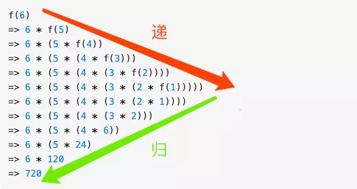
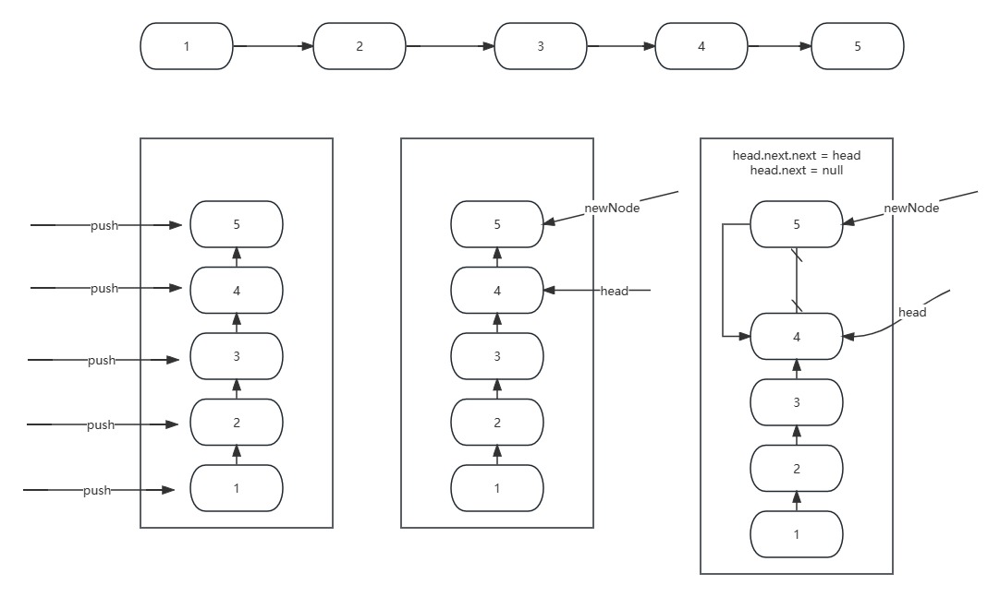
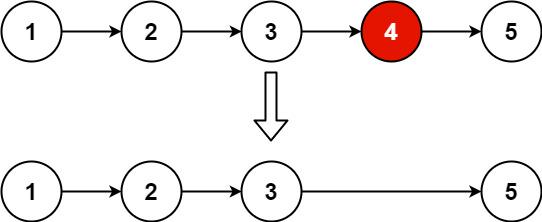
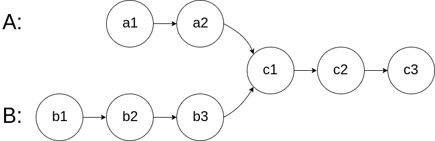
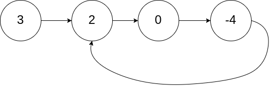
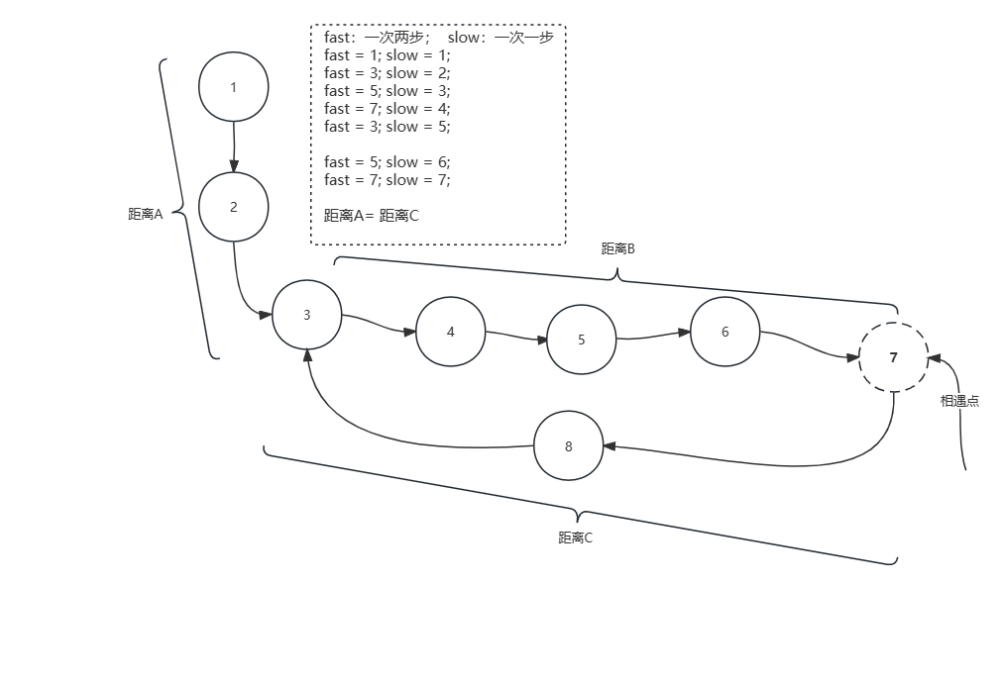

## 707. Design Linked List

* Your MyLinkedList object will be instantiated and called as such:
* MyLinkedList obj = new MyLinkedList();
* int param_1 = obj.get(index);
* obj.addAtHead(val);
* obj.addAtTail(val);
* obj.addAtIndex(index,val);
* obj.deleteAtIndex(index);

```java
class MyLinkedList {
    /**
     * 初始化定义链表节点
     */
    class LinkedNode {
        int val;
        LinkedNode next;
    }

    LinkedNode head;
    int size = 0;

    public MyLinkedList() {
        head = new LinkedNode(); // 定义头结点
        size = 0; // 初始化容量=0
    }
    
    public int get(int index) {
        // 如果索引大于size - 1那自然是不存在的
        if(index < 0 || index >= size) return -1;
        LinkedNode node = head;
        // 因为头结点的存在所以这里可以等于index
        for(int i = 0; i <= index; i++) {
            node = node.next;
        }
        return node.val;
    }
    
    public void addAtHead(int val) {
        LinkedNode node = new LinkedNode();
        node.val = val;
        node.next = head.next;
        head.next = node;
        size ++;
    }
    
    public void addAtTail(int val) {
        LinkedNode newNode = new LinkedNode();
        newNode.val = val;

        LinkedNode node = head;
        // 一直往前，直到到达最后一个节点
        while(node.next != null) {
            node = node.next;
        }
        node.next = newNode;
        size ++;
    }
    
    public void addAtIndex(int index, int val) {
        // 这里再写一次，又跪了，当index = size的时候，相当于在末尾插入
        if(index < 0 || index > size) return;

        LinkedNode newNode = new LinkedNode();
        newNode.val = val;

        LinkedNode node = head;
        // 这里要找删除节点的前一个节点
        for(int i = 0; i < index; i++) {
            node = node.next;
        }
        newNode.next = node.next;
        node.next = newNode;
        size ++;
    }
    
    public void deleteAtIndex(int index) {
        // 如果索引大于size - 1那自然是不存在的
        if(index < 0 || index >= size) return;

        LinkedNode node = head;
        // 这里要找删除节点的前一个节点
        for(int i = 0; i < index; i++) {
            node = node.next;
        }
        LinkedNode delNode = node.next;
        node.next = node.next.next;
        delNode.next = null;
        size --;
    }
}
```

## 206. Reverse Linked List
Given the head of a singly linked list, reverse the list, and return the reversed list.
### Recursion version




```java
public static ListNode reverseLinkedList(ListNode head) {
    // 如果根节点为空直接返回
    // 如果当前节点的下一个节点为空，那说明到达了链表的尾节点
    if (head == null || head.next == null) return head;
    ListNode newHead = reverseLinkedList(head.next);
    /**
     * head = 4 & newHead = 5
     * head = 3 & newHead = 5
     * head = 2 & newHead = 5
     * head = 1 & newHead = 5
     */
    // 此时，当head节点传入，满足其下一个节点为空，即开始回溯，newNode当前是尾节点
    // 那head.next是尾结点，那head自然是倒数第二个节点
    head.next.next = head;// 反转倒数第二个节点的下一个节点指向
    head.next = null;
    // 每次返回的都是最后一个尾结点，当递归回溯结束是，即是反转后的链表头节点
    return newHead;
}
```

### Traversal version
1 -> 2 -> 3 -> 4 -> 5
prev = null; cur= 1;  temp = 2; 
核心思想：3个指针；
- 第一个指向新的链表的头节点；prev
- 第二个指向当前要处理的节点；cur
- 第三个是把要处理的当前节点的后一个节点保存起来，因为一旦cur指向prev，后面需要找到cur.next = 2; 
```java
   class Solution {
    public ListNode reverseList(ListNode head) {
        ListNode prev = null; // 指向新链表的尾节点
        ListNode cur = head; // 取第一个节点
        while(cur != null) { // 迭代开始
            ListNode temp = cur.next; // A:把当前节点的下一个节点保存起来
            cur.next = prev; // 当前节点指向新链表的头节点，这就是为什么要A的原因
            prev = cur; // 当前的节点就是新链表的头节点，所以prev后移
            cur = temp; // 处理下一个节点，把temp赋给cur
        }
        return prev; // prev就是新链表的头节点
    }
}
```


## 19. Remove Nth Node From End of List
Given the head of a linked list, remove the n(th) node from the end of the list and return its head.
Example 1:

Input: head = [1,2,3,4,5], n = 2
Output: [1,2,3,5]
```java
    public ListNode removeNthFromEnd(ListNode head, int n) {
        if(head == null) return head;
        // 为什么要添加头结点，因为如果n=1,删除的是第一个节点，
        // 那得找到第一个节点的前一个节点做操作
        ListNode dummyHead = new ListNode();
        dummyHead.next = head;
        // 初始化两个节点指向dummyHead
        ListNode prev = dummyHead;
        ListNode current = dummyHead;
        // 应为题干n是从1开始，那当前节点先走n步骤，到达正数第N个节点
        for(int i = 0; i < n; i ++) {
            current = current.next;
        }
        // 循环往后，快慢指针同时往后移动，当快指针移动到最后一个节点时，
        // 慢指针指向的就是要删除节点的前一个节点
        while(current.next != null) {
            current = current.next;
            prev = prev.next;
        }
        // 执行删除操作
        prev.next = prev.next.next;
        // 这里要返回dummyHead.next；如果情况时链表只有一个节点，
        // 删除调唯一节点，还在返回head的话，就错了
        return dummyHead.next;
    }
```

## 160. Intersection of Two Linked Lists
Given the heads of two singly linked-lists headA and headB, return the node at which the two lists intersect. If the two linked lists have no intersection at all, return null.
For example, the following two linked lists begin to intersect at node c1:


The test cases are generated such that there are no cycles anywhere in the entire linked structure.
Note that the linked lists must retain their original structure after the function returns.
### Approach1-Using set
```java
    /**
     * 时间复杂度是：headA.size() + headB.size()
     */
    public ListNode getIntersectionNode(ListNode headA, ListNode headB) {
        // 两个链表如果相交，肯定有一个节点遍历的时候会重复，所以使用set
        // 这里切记不能放Integer，因为比较的是对象，而不是对象里的值
        Set<ListNode> set = new HashSet<>();

        while(headA != null) { // 把A链表的节点放到set中
            set.add(headA);
            headA = headA.next;
        }

        while(headB != null) { // 迭代B链表
            // 如果找到节点，返回相交的节点
            if(set.contains(headB)) return headB;
            headB = headB.next;
        }

        return null; // 否则返回空
    }
```

### Approach2-Path Cover
LinkedListA = a1->a2->c1->c2->c3；LinedListB = b1->b2->b3->c1->c2->c3；
- 如果相交：
链表A走过的路径是a+c;链表B走过的路径是b+c；如果两个链表必然相交；那走的路径一定是一样的；所以A走到完后再走B的路径，B走完后再走A的路径，如果有交集，肯定在同一个点汇合；
- 如果不相交
最后两个链表遍历完，A遍历一遍自己，再遍历一遍B；B遍历一遍自己，再遍历一遍A;两个指针走的路程也是一样的，但是最终都指向null；
```java
    public ListNode getIntersectionNode(ListNode headA, ListNode headB) {
        ListNode nodeA = headA;
        ListNode nodeB = headB;
        // 这里就有两种情况，相交(指向同一个节点)
        // 或者不相交(两个都是null)，循环都会结束。
        while(nodeA != nodeB) {
            // 这里注意，走完A的路程，走B的路程，
            // 不是nodeA = nodeB,是 nodeA = headB，从B的头节点开始
            if(nodeA == null) nodeA = headB;
            // 这里也要有else，如果走到了末尾，
            // 直接从另一个链表的头开始，也就是相当于后移了
            else nodeA = nodeA.next;
            // 同上
            if(nodeB == null) nodeB = headA;
            else nodeB = nodeB.next;
        }
        return nodeA; // 这里就有可能返回相交节点，或者null了
    }
```


## 141. Linked List Cycle
Given head, the head of a linked list, determine if the linked list has a cycle in it.
There is a cycle in a linked list if there is some node in the list that can be reached again by continuously following the next pointer. Internally, pos is used to denote the index of the node that tail's next pointer is connected to. Note that pos is not passed as a parameter.
Return true if there is a cycle in the linked list. Otherwise, return false.
 
Example 1:



```java
    public boolean hasCycle(ListNode head) {
        // 相当于两个人在操场上跑步，一个人速度是1；另一个速度是2；
        // 那在1跑完一圈前，因为2速度快，肯定会相遇
        ListNode slow = head;
        ListNode fast = head;
        while(fast != null && fast.next != null) { // 这里要判断一下
            fast = fast.next.next; // 不然会空指针
            slow = slow.next;
            if(fast == slow) return true;
        }
        return false;
    }
```

## 142. Linked List Cycle II
Given the head of a linked list, return the node where the cycle begins. If there is no cycle, return null.
There is a cycle in a linked list if there is some node in the list that can be reached again by continuously following the next pointer. Internally, pos is used to denote the index of the node that tail's next pointer is connected to (0-indexed). It is -1 if there is no cycle. Note that pos is not passed as a parameter.
Do not modify the linked list.
 
Example 1:


Input: head = [3,2,0,-4], pos = 1
Output: tail connects to node index 1
Explanation: There is a cycle in the linked list, where tail connects to the second node.



```js
    // 数学推导过程：
    Fast = A + (B + C) * n + B
    Fast = A + B*n + C*n + B
    Fast = A + (n + 1) * b + C*n

    Slow = A + B

    Fast = Slow * 2 // 快指针速度是慢指针的两倍

    => A + (n + 1) * B + n*C = (A + B) * 2
    => A + n*B + B + n*C = 2A + 2B
    => n*B + n*C = A + B
    => A = (n - 1) * B + n * C
    => A = (n - 1) * B + (n - 1) * C + C
    => A = (n - 1) * (B + C) + C
    // 因为B + C就是一个环，所以如果n=1带入
    => A = C
    // 从相遇点到入环点的距离加上 n−1 圈的环长，恰好等于从链表头部到入环点的距离。
```

```java title="java solution"
    public ListNode detectCycle(ListNode head) {
        ListNode fast = head;
        ListNode slow = head;
        // 快慢指针，往后移动
        while(fast != null && fast.next != null) {
            fast = fast.next.next; // 两步
            slow = slow.next;
            if(fast == slow) { // 相遇说明有环
                fast = head; // 快指针重新指向头结点
                // 一定会再次相遇，所以如果还没相遇，同步后移
                while(fast != slow) {
                    fast = fast.next;
                    slow = slow.next;
                }
                return fast;//这是相遇后的节点，直接返回其一
            }
        }
        return null; // 没有环，也就是说没有相遇节点
    }
```

## 146. LRU Cache
Design a data structure that follows the constraints of a Least Recently Used (LRU) cache.
Implement the LRUCache class:
- LRUCache(int capacity) Initialize the LRU cache with positive size capacity.
- int get(int key) Return the value of the key if the key exists, otherwise return -1.
- void put(int key, int value) Update the value of the key if the key exists. Otherwise, add the key-value pair to the cache. If the number of keys exceeds the capacity from this operation, evict the least recently used key.
The functions get and put must each run in O(1) average time complexity.

```java
class LRUCache {
    // The functions get and put must each run in O(1) average time complexity.
    // 为什么要用map？因为get时间复杂度要求O(1)，
    // 只有数组和hash满足，但是数组插入删除要移动
    // 有了hashMap后，解决了get=O(1)的问题和put=O(1)的问题，
    // 还有使用频次排序的问题，容量的限制，超出容量需要移除掉最少使用的元素
    // 所以用链表，链表的头部add和delete都是O(1)的，
    // 所以将最近访问的插入到头部，删除的话放在队尾，那问题来了，
    // 放在队尾如何删除做到O(1)那就得用双向链表
    // 使用双向链表的第二个问题是：链表删除节点需要先找到前一个节点，所以要用双向
    // 这时map的value就不能存储值了，应该是存储链表的指针
    // Java的HashMap中插入和删除的时间复杂度为O(1)
    // 总之：使用hashmap是解决查找O(1)的问题；
    // 使用linkedList是解决访问频次次序问题；
    // 为了操作方便使用双向链表更容易删除尾节点实现删除全部O(1)
    class LinkedNode {
        int key;
        int val;
        LinkedNode next;
        LinkedNode prev;
        
        public LinkedNode() {
        }

        /**
         * 这里要注意key和value，都要存，删除节点的时候，
         * 要根据key获得hashmap中的值进行删除
         */
        public LinkedNode(int key, int val) {
            this.key = key;
            this.val = val;
        }
    }

    private Map<Integer, LinkedNode> cache;
    private LinkedNode dummyHead;  // 链表头
    private LinkedNode dummyTail;  // 链表尾

    private int len = 0; // 存储的数量
    private int capacity = 0; // 最大容量

    public LRUCache(int capacity) {
        cache = new HashMap<>(capacity);
        dummyHead = new LinkedNode();
        dummyTail = new LinkedNode();
        dummyHead.next = dummyTail; // 不要忘了指向
        dummyTail.prev = dummyHead; // 不要忘了指向
        this.capacity = capacity;
    }
    
    public int get(int key) {
        LinkedNode node = cache.get(key);
        if(node == null) return -1; // 节点不存在
        // 访问过一次了，需要将节点移动到链表的头部，代表最近访问
        removeNode(node); 
        // 将该节点插入头节点之后，hash表持有的引用不用改变
        addNodeAtHead(node);
        return node.val;
    }

    public void put(int key, int value) {
        LinkedNode node = cache.get(key);
        if(node == null) {// 如果节点没有找到创建一个
            node = new LinkedNode(key, value);
            cache.put(key, node);
            if(this.len >= this.capacity) { // 超出容量
                // 删除最少使用的元素，也就是队尾元素
                LinkedNode delNode = dummyTail.prev;
                removeNode(delNode); // 删除节点
                cache.remove(delNode.key); // 删除hashMap值
            }
        } else {
            // 注意这里并不需要删除hash里的值，因为只是链表中的位置变了
            node.val = value; // 否则改数值
            removeNode(node); // 需要将节点从链表中删除
        }
        // 在头部加入元素，不管节点是否存在都需要重新加入到头结点后第一个
        addNodeAtHead(node);
    }

    private void addNodeAtHead(LinkedNode newNode) {
        // 修改正向指向
        newNode.next = dummyHead.next;
        dummyHead.next = newNode;
        // 修改反向指向
        newNode.next.prev = newNode;
        newNode.prev = dummyHead;
        len ++;
    }

    private void removeNode(LinkedNode node) {
        node.prev.next = node.next;
        node.next.prev = node.prev;
        node.next = null; // 这里建议值为空，和链表脱离关系
        node.prev = null; // 这里建议值为空，和链表脱离关系
        len --;
    }
}
```