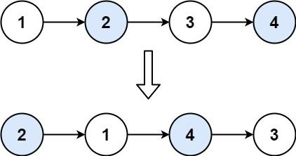
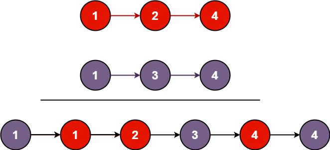
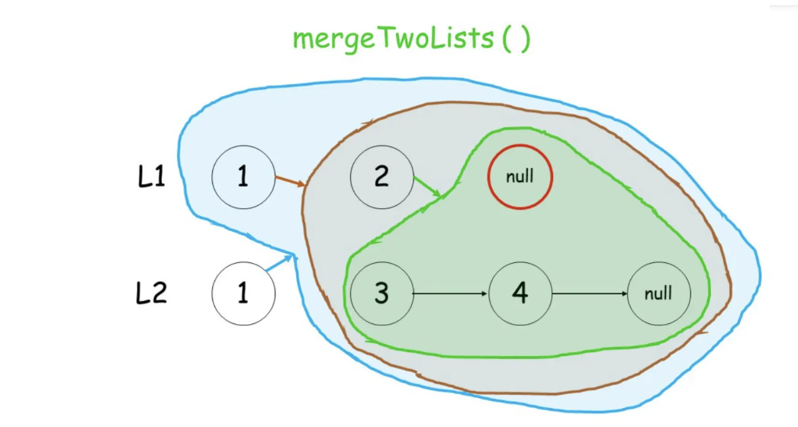

# Divide and Conquer & Recursion

## 704. Binary Search
Given an array of integers nums which is sorted in ascending order, and an integer target, write a function to search target in nums. If target exists, then return its index. Otherwise, return -1.
You must write an algorithm with O(log n) runtime complexity.
- Example 1:
   - Input: nums = [-1,0,3,5,9,12], target = 9
   - Output: 4
   - Explanation: 9 exists in nums and its index is 4
- Example 2:
   - Input: nums = [-1,0,3,5,9,12], target = 2
   - Output: -1
   - Explanation: 2 does not exist in nums so return -1

```java title="迭代"
class Solution {
    public int search(int[] nums, int target) {
        // 确定区间：是左闭右闭
        int left = 0;
        int right = nums.length - 1; // 这里记得减一
        while(left <= right) {
            // left = 0; right = 5; 
            // mid = (5 - 0) / 2 = (right - left) / 2 = 2;
            
            // left = 2; right = 5; 
            // mid = 2 + (5 - 2) / 2 = left + (right - left) / 2 = 3;
            // 求中间位置，表达式
            int mid = left + (right - left) / 2;
            // 也可以这样写
            // int mid = (left + right) / 2;
            // 1-2-3-4-5; mid = 3
            if(nums[mid] > target) { // 目标值在mid左边
                right = mid - 1; // 所以这里要减一，已经不能包含mid了
            } else if(nums[mid] < target) { // 目标值在mid右边
                left = mid + 1;// 所以这里要加一，已经不能包含mid了
            } else {
                return mid;
            }
        }
        return -1;
    }
}
```

```java title="左闭右开区间，写法"
class Solution {
    public int search(int[] nums, int target) {
        int startIndex = 0;
        int endIndex = nums.length;
        while(startIndex < endIndex) {
            int midIndex = (startIndex + endIndex) / 2;
            if(target > nums[midIndex]) startIndex = midIndex + 1;
            else if(target < nums[midIndex]) endIndex = midIndex;
            else return midIndex;
        }
        return -1;
    }
}
```

```java title="递归"
 class Solution {
    public int search(int[] nums, int target) {
        // length - 1，不然就错了
        return search(nums, 0, nums.length - 1, target);
    }

    private int search(int[] nums, int left, int right, int target) {
        // 递归什么时候结束？
        if(left > right) return -1;
        // int mid = left + (right - left) / 2;
        // 也可以这样写
        int mid = (left + right) / 2;
        if(nums[mid] > target) return search(nums, left, mid - 1, target);
        if(nums[mid] < target) return search(nums, mid + 1, right, target);
        return mid;
    }
}
```

## 50. Pow(x, n)
Implement pow(x, n), which calculates x raised to the power n (i.e., x(n)).
- Example 1: Input: x = 2.00000, n = 10 Output: 1024.00000
- Example 2: Input: x = 2.10000, n = 3 Output: 9.26100
- Example 3: Input: x = 2.00000, n = -2 Output: 0.25000 Explanation: 2(-2) = 1/2(2) = 1/4 = 0.25
```java
class Solution {
    public double myPow(double x, int n) {
        // 如果n是负数，转换为正数执行，1.0 除以结果，得到负数结果
        return n >= 0 ? quickMul(x, n) : 1.0 / quickMul(x, -n);
    }

    public double quickMul(double x, int n) {
        // 递归终止条件
        if (n == 0) return 1.0;
        // 这里减少重复计算
        double y = quickMul(x, n / 2);
        // 如果n是偶数，y * y; 如果是奇数那就是再乘以x本身
        return n % 2 == 0 ? y * y : y * y * x;
    }
}
```

## 206. Reverse Linked List
Given the head of a singly linked list, reverse the list, and return the reversed list.

```java
class Solution {
    public ListNode reverseList(ListNode head) {
        // 如果节点为空，直接返回
        // 如果节点不为空，那递归终止条件：如果head.next == null 就是最后一个节点
        if(head == null || head.next == null) return head;
        ListNode newHead = reverseList(head.next);
        // 这里开始出栈，既然当前newHead是最后衣一个节点
        // 那传入的head节点就是倒数第二个节点
        head.next.next = head; // 末尾节点指向倒数第二个节点
        head.next = null; // 导出第二个节点指向null
        // 每次递归回溯后newHead始终是最后一个节点所以直接返回
        return newHead;
    }
}
```

```java title="another explaination"
class Solution {
    public ListNode reverseList(ListNode head) {
        // 递归终止条件
        if(head == null) return head;
        if(head.next == null) return head;
        // 大问题处理为小问题
        // 假设链表1->2->3->4中，2->3-4已经倒转好
        // 状态如：1->2<-3<-4<-newHead;
        //        ^  |
        //        |__|
        ListNode newHead = reverseList(head.next);
        // 只需要将当前节点(1)与(2)处理一下
        head.next.next = head; // 2指向1
        head.next = null; // 1指向空
        return newHead;
    }
}
```

24. Swap Nodes in Pairs
Given a linked list, swap every two adjacent nodes and return its head. You must solve the problem without modifying the values in the list's nodes (i.e., only nodes themselves may be changed.)
 
- Example 1:
  - Input: head = [1,2,3,4] Output: [2,1,4,3]
  - 
- Example 2: Input: head = [] Output: []
- Example 3: Input: head = [1] Output: [1]
- 
```java
class Solution {
    public ListNode swapPairs(ListNode head) {
        if(head == null || head.next == null) return head;
        // 1->2->3->4；
        // 大问题拆解为小问题，假设要处理1,2后面的3->4被处理好
        // 要处理的问题就是前两个节点与后面处理好的节点的关系
        // head = 1; next = 2
        ListNode next = head.next;
        // 处理2后面的链表：3 -> 4
        // temp = 4->3
        ListNode temp = swapPairs(next.next);
        // 1指向 4->3 => 1 -> 4 -> 3
        head.next = temp;
        // 2 指向1 => 2 -> 1 -> 4 -> 3
        next.next = head;
        // 返回2：2 -> 1 -> 4 -> 3
        return next;
    }
}
```

## 21. Merge Two Sorted Lists
You are given the heads of two sorted linked lists list1 and list2.
Merge the two lists into one sorted list. The list should be made by splicing together the nodes of the first two lists.
Return the head of the merged linked list.
- Example 1: 
  - Input: list1 = [1,2,4], list2 = [1,3,4] Output: [1,1,2,3,4,4]
  - 

- Example 2: Input: list1 = [], list2 = [] Output: []
- Example 3: Input: list1 = [], list2 = [0] Output: [0]



```java
class Solution {
    public ListNode mergeTwoLists(ListNode list1, ListNode list2) {
        if(list1 == null) return list2; // 取不为空的直接返回
        if(list2 == null) return list1; // 取不为空的直接返回
        // 每次取比较后，节点较小的节点返回
        // 然后较小节点的后一个节点与剩余另一个链表节点做处理
        if(list1.val < list2.val) {
            list1.next = mergeTwoLists(list1.next, list2);
            return list1;
        } else {
            list2.next = mergeTwoLists(list1, list2.next);
            return list2;
        }
    }
}
```

## 23. Merge k Sorted Lists
TODO
剑指 Offer 51. 数组中的逆序对 LCOF
TODO
归并排序
TODO

## 53. Maximum Subarray
Given an integer array nums, find the subarray with the largest sum, and return its sum.
- Example 1:
  - Input: nums = [-2,1,-3,4,-1,2,1,-5,4]
  - Output: 6
  - Explanation: The subarray [4,-1,2,1] has the largest sum 6.
- Example 2:
  - Input: nums = [1]
  - Output: 1
  - Explanation: The subarray [1] has the largest sum 1.
- Example 3:
  - Input: nums = [5,4,-1,7,8]
  - Output: 23
  - Explanation: The subarray [5,4,-1,7,8] has the largest sum 23.