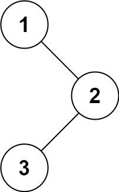
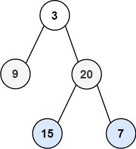
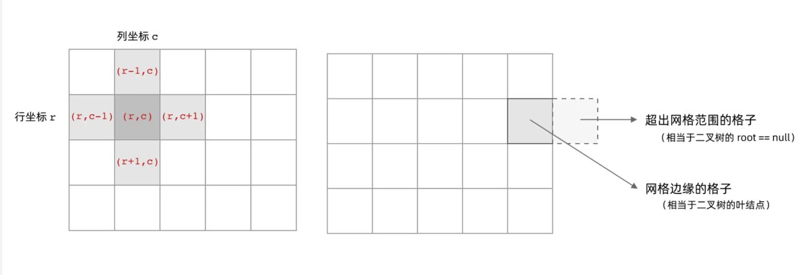

# DFS&BSF

## 144. Binary Tree Preorder Traversal
Given the root of a binary tree, return the preorder traversal of its nodes' values.
- Example 1:
  - 
  - Input: root = [1,null,2,3] Output: [1,2,3]

- Example 2: Input: root = [] Output: []
- Example 3: Input: root = [1] Output: [1]

```java title="递归"
/**
 * 递归
 */
class Solution {
    List<Integer> result = new ArrayList<>();
    public List<Integer> preorderTraversal(TreeNode root) {
        preorderRecursion(root);
        return result;
    }

    private void preorderRecursion(TreeNode node) {
        if(node == null) return; // 递归终止条件
        result.add(node.val); // 中
        if(node.left != null) recursion(node.left);// 左
        if(node.right != null) recursion(node.right); // 右
    }
}
```

```java title="遍历1"
/**
 * 遍历1
 */
class Solution {
    public List<Integer> preorderTraversal(TreeNode root) {
        List<Integer> result = new ArrayList<>();
        if(root == null) return result;
        // 这里是放的节点对象，不是值
        // 放值怎么找左右孩子？
        Deque<TreeNode> deque = new ArrayDeque<>();
        deque.offerLast(root);
        while(!deque.isEmpty()) {
            TreeNode temp = deque.pollLast();
            result.add(temp.val); //中节点
            // 这里为什么要先放右节点
            // 因为是用栈模拟，所以后加入的先出栈
            // 也就是left节点先出栈，符合preorder traversal
            if(temp.right != null) deque.offerLast(temp.right);
            if(temp.left != null) deque.offerLast(temp.left);
        }
        return result;
    }
}
```

```java title="遍历2"
/**
 * 遍历2
 */
class Solution {
    public List<Integer> preorderTraversal(TreeNode root) {
        List<Integer> result = new ArrayList<>();
        if(root == null) return result;
        // 这里是放的节点对象，不是值
        // 放值怎么找左右孩子？
        Deque<TreeNode> deque = new ArrayDeque<>();
        deque.offerLast(root);
        while(!deque.isEmpty()) {
            // 队列头部出队
            // 这里的顺序，决定了可以先加入左节点，再加入右节点
            TreeNode temp = deque.pollFirst();
            result.add(temp.val); //中节点
            // 加入左节点
            if(temp.left != null) deque.offerLast(temp.left);
            // 加入右节点
            if(temp.right != null) deque.offerLast(temp.right);
        }
        return result;
    }
}
```

## 102. Binary Tree Level Order Traversal
Given the root of a binary tree, return the level order traversal of its nodes' values. (i.e., from left to right, level by level).
- Example 1:
  - 
  - Input: root = [3,9,20,null,null,15,7] Output: [[3],[9,20],[15,7]]
- Example 2: Input: root = [1] Output: [[1]]
- Example 3: Input: root = [] Output: []

```java
class Solution {
    public List<List<Integer>> levelOrder(TreeNode root) {
        List<List<Integer>> result = new ArrayList<>();
        if(root == null) return result;
        // 为什么要用队列？
        // 因为队列有序出入，先进先出
        // 访问到该节点后，处理完队列中当前层数据
        // 再把当前层每一个节点的左右孩子一次加入
        // 下次循环便是按每一层有序的
        Queue<TreeNode> queue = new LinkedList<>();
        queue.offer(root);
        while(!queue.isEmpty()) {
            // 获取当前层所有节点数量
            int size = queue.size();
            List<Integer> layer = new ArrayList<>(size);
            // 本层节点全部出队
            for(int i = 0; i < size; i++) {
                TreeNode node = queue.poll();
                layer.add(node.val);
                // 出队的同时，将左右孩子加入队列，形成下一层数据
                if(node.left != null) queue.offer(node.left);
                if(node.right != null) queue.offer(node.right);
            }
            result.add(layer);
        }
        return result;
    }
}
```

## 1.   Number of Islands
Given an m x n 2D binary grid grid which represents a map of '1's (land) and '0's (water), return the number of islands.
An island is surrounded by water and is formed by connecting adjacent lands horizontally or vertically. You may assume all four edges of the grid are all surrounded by water.
- Example 1: 
  - Input: 
    ```
    grid = [
            ["1","1","1","1","0"],
            ["1","1","0","1","0"],
            ["1","1","0","0","0"],
            ["0","0","0","0","0"]
        ]
    ```

  - Output: 1

- Example 2: 
  - Input: 
    ```
    grid = [
            ["1","1","0","0","0"],
            ["1","1","0","0","0"],
            ["0","0","1","0","0"],
            ["0","0","0","1","1"]
        ]
    ```
- Output: 3

Best Answer: [https://leetcode.cn/problems/number-of-islands/solutions/211211/dao-yu-lei-wen-ti-de-tong-yong-jie-fa-dfs-bian-li-/](https://leetcode.cn/problems/number-of-islands/solutions/211211/dao-yu-lei-wen-ti-de-tong-yong-jie-fa-dfs-bian-li-/)



```java
class Solution {
    public int numIslands(char[][] grid) {
        int count = 0;
        for(int i = 0; i < grid.length; i++) {
            for(int j = 0; j < grid[i].length; j++) {
                // 如果遇到1，数量+1
                // 如何在遍历的时候，上下左右的靠近元素如果是1的时候跳过？
                // 就是在遍历到当前位置如果是1的时候
                // 将上下左右改成其他值
                if(grid[i][j] == '1') {
                    // dfs会提前把上下左右是1的全部改成2
                    // 所以一次遍历，之前是1的已经变成了2
                    // 就会跳过，只加1次
                    dfs(grid, i, j);
                    count ++;
                }
            }
        }
        return count;
    }

    private void dfs(char[][] grid, int i, int j) {
        // 判断i，j是否越界
        if(i < 0 || i >= grid.length) return;
        if(j < 0 || j >= grid[0].length) return;
        // 不是陆地
        if(grid[i][j] == '0') return;
        // 已经标记过
        if(grid[i][j] == '2') return;
        // 标记
        grid[i][j] = '2';
        // 递归处理上右下左
        dfs(grid, i - 1, j);
        dfs(grid, i, j + 1);
        dfs(grid, i + 1, j);
        dfs(grid, i, j - 1);
    }
}
```

## 207. Course Schedule
There are a total of numCourses courses you have to take, labeled from 0 to numCourses - 1. You are given an array prerequisites where prerequisites[i] = [a(i), b(i)] indicates that you must take course b(i) first if you want to take course a(i).
- For example, the pair [0, 1], indicates that to take course 0 you have to first take course 1.
Return true if you can finish all courses. Otherwise, return false.
- Example 1:
  - Input: numCourses = 2, prerequisites = [[1,0]]
  - Output: true
  - Explanation: There are a total of 2 courses to take. To take course 1 you should have finished course 0. So it is possible.
- Example 2:
  - Input: numCourses = 2, prerequisites = [[1,0],[0,1]]
  - Output: false
  - Explanation: There are a total of 2 courses to take. To take course 1 you should have finished course 0, and to take course 0 - you should also have finished course 1. So it is impossible.

```java
    public boolean canFinish(int numCourses, int[][] prerequisites) {
        // 构建邻接表? 为什么要构建直接用prerequisites不行吗？
        List<Integer>[] adjacencyList = new ArrayList[numCourses];
        for(int i = 0; i < numCourses; i++) {
            adjacencyList[i] = new ArrayList<>();
        }
        // 记录节点的入度
        int[] inDegrees = new int[numCourses];
        // 填充领接表
        for(int i = 0; i < prerequisites.length; i++) {
            int[] edge = prerequisites[i];
            int from = edge[1]; // 根据题意，后面一个是先决课程
            int to = edge[0];
            adjacencyList[from].add(to);
            // 记录节点的入度
            inDegrees[to] ++;
        }
        // 队列
        Queue<Integer> queue = new LinkedList<>();
        // 将入度为0的节点入队列
        for(int i = 0; i < inDegrees.length; i++) {
            if(inDegrees[i] == 0) queue.offer(i);
        }
        int pollCount = 0;
        // BFS
        while(!queue.isEmpty()) {
            // 出队
            pollCount ++;
            int prev = queue.poll();
            // 出队数量 + 1 (已经遍历过的数量)
            // 拿到该节点的领接表
            List<Integer> aList = adjacencyList[prev];
            for(int cur : aList) {
                // 领接表中的入度-1
                inDegrees[cur] --;
                // 判断领接表中的节点的入度,是否为0
                if(inDegrees[cur] == 0) queue.offer(cur);
            }
        }
        // 根据拓扑排序(Topological Sort)的规则
        // 如果遍历节点的数量等于队列出队数量，那就是无环
        // 拓扑排序步骤：
        // 1. 找到入度为0的节点
        // 2. 删除该节点，加入结果中 
        // 3.循环1和2直到没有满足条件1的节点。
        return pollCount == numCourses;
    }
```

## 743. Network Delay Time
TODO