## Concepts
### Normal Binary Tree
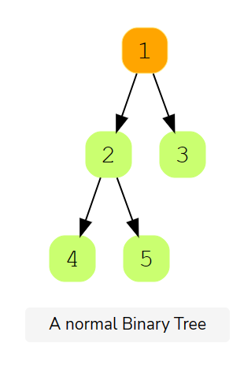


### Complete Binary Tree
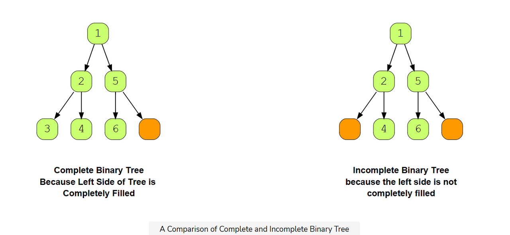

### Full Binary Tree
- Every node has 0 or 2 children. No node can have 1 child.
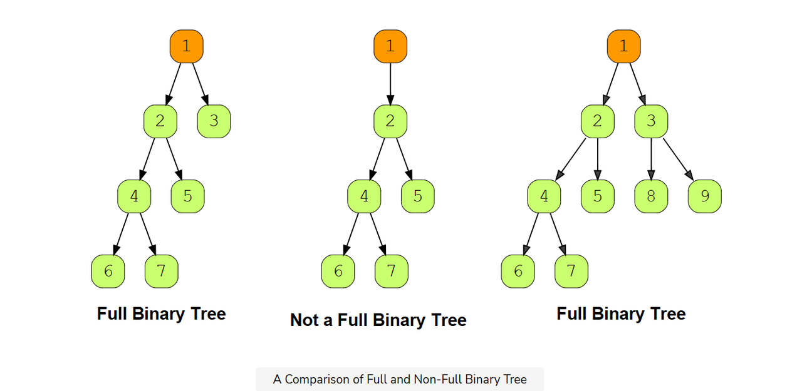

### Perfect Binary Tree
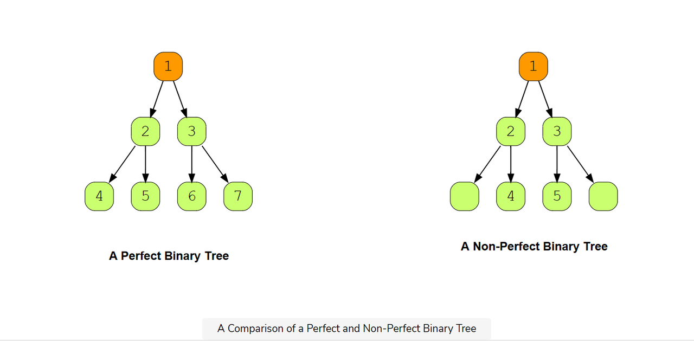

### Binary Search Tree(BST)
- leftNode < CurrentNode < RightNode
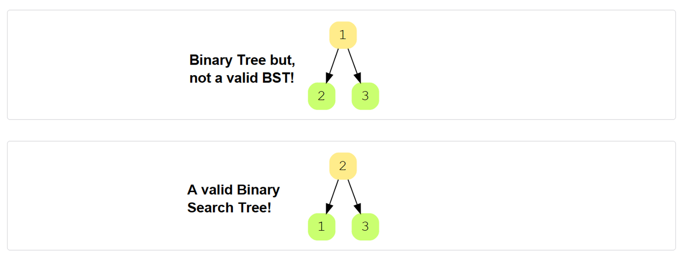

### Skewed Binary Tree


### AVL Tree
- AVL trees are a self-balanced special type of Binary Search Tree with just one exception:
- For each Node, the maximum height difference between the left and right sub-trees can only be one.
- If at any point their difference becomes more than one, then re-balancing is applied to make it a valid AVL tree.

- This is an AVL Tree

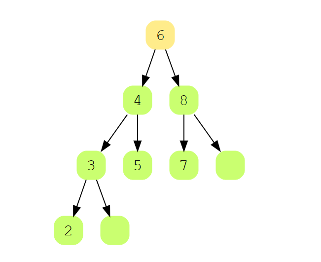

- This isn't an AVL Tree

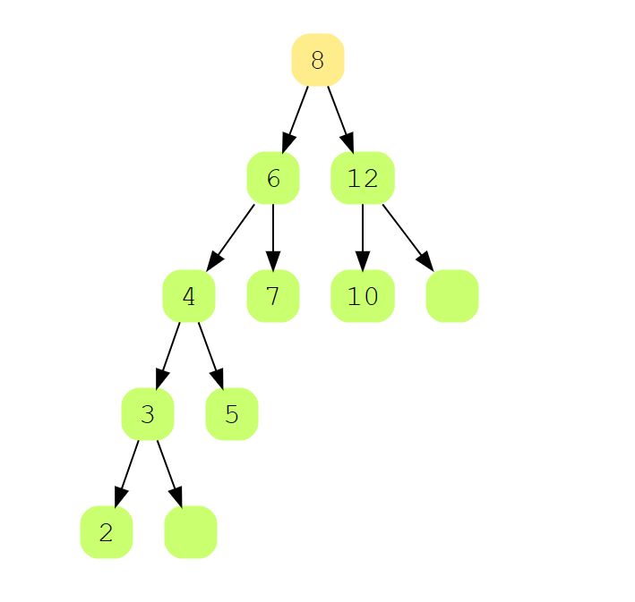


## 94. Binary Tree Inorder Traversal
### Loop
```js
class Solution {
    public List<Integer> inorderTraversal(TreeNode root) {
        List<Integer> result = new ArrayList<>();
        TreeNode cur = root;
        Stack<TreeNode> stack = new Stack<>();
        while(cur != null || !stack.isEmpty()) {
            if(cur != null) {
                // 每次加入当前节点后
                stack.push(cur);
                // 立刻替换当前节点为左孩子
                // 这样下一次循环肯定是左孩子
                // 当然也有可能是空
                cur = cur.left;
            } else { 
                // 当节点为空，说明左孩子为空
                // 栈顶元素是midNode
                TreeNode treeNode = stack.pop();
                result.add(treeNode.val);
                // 处理右孩子
                cur = treeNode.right;
            }
        }
        return result;
    }
}
```


### Recursion
```js
class Solution {
    public List<Integer> inorderTraversal(TreeNode root) {
        List<Integer> list = new ArrayList<>();
        recursion(root, list);
        return list;
    }

    private void recursion(TreeNode root, List<Integer> list) {
        if(root == null) return;
        recursion(root.left, list);
        list.add(root.val);
        recursion(root.right, list);
    }
}
```

## 144. Binary Tree Preorder Traversal
### Loop
```js
class Solution {
    public List<Integer> preorderTraversal(TreeNode root) {
        List<Integer> result = new ArrayList<>();
        if(root == null) return result;
        // 这里是放的节点对象，不是值
        // 放值怎么找左右孩子？
        Deque<TreeNode> deque = new ArrayDeque<>();
        deque.offerLast(root);
        while(!deque.isEmpty()) {
            // 队列头部出队
            // 这里的顺序，决定了可以先加入左节点，再加入右节点
            TreeNode temp = deque.pollFirst();
            result.add(temp.val); //中节点
            // 加入左节点
            if(temp.left != null) deque.offerLast(temp.left);
            // 加入右节点
            if(temp.right != null) deque.offerLast(temp.right);
        }
        return result;
    }
}
```
### Recursion
```js
class Solution {
    List<Integer> result = new ArrayList<>();

    public List<Integer> preorderTraversal(TreeNode root) {
        recursion(root);
        return result;
    }

    private void recursion(TreeNode node) {
        if(node == null) return;
        result.add(node.val);
        if(node.left != null) recursion(node.left);
        if(node.right != null) recursion(node.right);
    }
}
```

## 145. Binary Tree Postorder Traversal
### Loop
```js
public List<Integer> postorderTraversal(TreeNode root) {
    List<Integer> list = new ArrayList<>();
    if(root == null) return list;
    Stack<TreeNode> stack = new Stack<>();
    // 前序遍历=中-左-右 ; 压栈顺序=处理中间节点-右压栈-左压栈
    // 后续遍历=左-右-中；只需要把左右压栈顺序调换，然后结果反转
    // 后续遍历,压栈顺序 = 处理中间节点-左压栈-右压栈
    // 后续遍历,出栈循序 = 中-右-左 => 反转：中-左-右
    stack.push(root);
    while(!stack.isEmpty()) {
        TreeNode treeNode = stack.pop();
        list.add(treeNode.val);
        if(treeNode.left != null) stack.push(treeNode.left);
        if(treeNode.right != null) stack.push(treeNode.right);
    }
    Collections.reverse(list);
    return list;
}
```

### Recursion
```js
class Solution {
    public List<Integer> postorderTraversal(TreeNode root) {
        List<Integer> list = new ArrayList<>();
        recursive(root, list);
        return list;
    }

    private void recursive(TreeNode root, List<Integer> list) {
        if(root == null) return;
        recursive(root.left, list);
        recursive(root.right, list);
        list.add(root.val);
    }
}
```

## 104. Maximum Depth of Binary Tree
:::tip
Given the root of a binary tree, return its maximum depth.
A binary tree's maximum depth is the number of nodes along the longest path from the root node down to the farthest leaf node.
- Example 1:

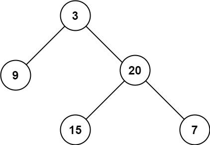

Input: root = [3,9,20,null,null,15,7]

Output: 3
:::

### DFS Solution
```js
class Solution {
    public int maxDepth(TreeNode root) {
        // 为什么采取中序遍历？
        // 因为最大深度需要在树的顶点得到
        if(root == null) return 0; // 为空，深度=0
        int leftMaxDepth = maxDepth(root.left);
        int rightMaxDepth = maxDepth(root.right);
        // 左边树的最大深度 + 右边树的最大深度 + 1(当前节点的深度为1)
        return Math.max(leftMaxDepth, rightMaxDepth) + 1;
    }
}
```

### BFS Solution
```js
class Solution {
    public int maxDepth(TreeNode root) {
        int maxDepth = 0;
        if(root == null) return maxDepth;

        Queue<TreeNode> queue = new LinkedList<>();
        queue.offer(root);
        while(!queue.isEmpty()) {
            // 每次出队都是同一层级的
            int size = queue.size();
            for(int i = 0; i < size; i++) {
                TreeNode node = queue.poll();
                if(node.left != null) queue.offer(node.left);
                if(node.right != null) queue.offer(node.right);
            }
            // 没做完一层，数量+1
            maxDepth ++;
        }
        return maxDepth;
    }
}
```

## 111. Minimum Depth of Binary Tree
:::tip
Given a binary tree, find its minimum depth.
The minimum depth is the number of nodes along the shortest path from the root node down to the nearest leaf node.
Note: A leaf is a node with no children.
- Example 1:
  
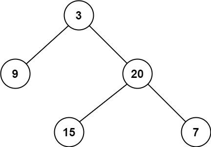

Input: root = [3,9,20,null,null,15,7]

Output: 2
:::

```js
class Solution {
    public int minDepth(TreeNode root) {
        if(root == null) return 0;
        // 获取左右最小深度（skewed tree情况）
        // 如果左子树为空，那该节点的深度应该是右子树深度+1
        // 反之亦然
        // 相对于求最大深度，这里为什么要这样处理？
        // 因为求最大深度时，求得是最大，即是小的深度不也无影响
        int leftMinDepth = minDepth(root.left);
        int rightMinDepth = minDepth(root.right);
        // 如果左子树为空，那就是右子树最小深度+1
        if(root.left == null) return rightMinDepth + 1;
        // 如果右子树为空，那就是左子树最小深度+1
        if(root.right == null) return leftMinDepth + 1;
        // 如果左右都不为空，取左右子树较小的深度+1
        return Math.min(leftMinDepth, rightMinDepth) + 1;
    }
}
```

## 110. Balanced Binary Tree
:::tip
Given a binary tree, determine if it is height-balanced
- Example 1:
  
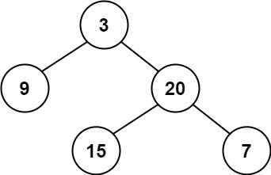

Input: root = [3,9,20,null,null,15,7] 

Output: true
:::

### Solution1
```js
class Solution {
    public boolean isBalanced(TreeNode root) {
        return getHeight(root) != -1;
    }

    private int getHeight(TreeNode root) {
        if(root == null) return 0;
        // 如果左子树已经不平衡，直接返回
        int leftHeight = getHeight(root.left);
        if(leftHeight == -1) return -1;
        // 如果右子树已经不平衡，直接返回
        int rightHeight = getHeight(root.right);
        if(rightHeight == -1) return -1;
        // 如果左右子树的高度差大于1，返回-1，标记为not balanced.
        if(Math.abs(leftHeight - rightHeight) > 1) return -1;
        return Math.max(leftHeight, rightHeight) + 1;
    }
}
```
### Solution2
```js
/**
 * 平衡二叉树的定义?
 * 左子树是平衡二叉树• 
 * 右子树是平衡二叉树•
 * 左右子树高度差不大于
 */
class Solution {
    public boolean isBalanced(TreeNode root) {
        if(root == null) return true;
        // 判断当前节点，左右子树是否平衡
        int leftHeight = getHeight(root.left);
        int rightHeight = getHeight(root.right);
        boolean condition1 = Math.abs(leftHeight - rightHeight) <= 1;
        // 判断左子树是否平衡
        boolean condition2 = isBalanced(root.left);
        // 判断右子树是否平衡
        boolean condition3 = isBalanced(root.right);
        // 都满足才算平衡
        return condition1 & condition2 & condition3;
    }

    private int getHeight(TreeNode node) {
        if(node == null) return 0;
        return Math.max(getHeight(node.left), getHeight(node.right)) + 1;
    }
}
```

## 98. Validate Binary Search Tree

:::tip
Given the root of a binary tree, determine if it is a valid binary search tree (BST).
A valid BST is defined as follows:
- The left 
- subtree
-  of a node contains only nodes with keys less than the node's key.
- The right subtree of a node contains only nodes with keys greater than the node's key.
- Both the left and right subtrees must also be binary search trees.

- Example 1:
  - 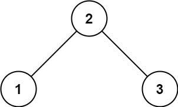
  - Input: root = [2,1,3] 
  - Output: true

- Example 2:
  - 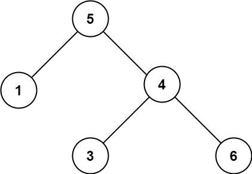
  - Input: root = [5,1,4,null,null,3,6]
  - Output: false
  - Explanation: The root node's value is 5 but its right child's value is 4.

:::

### Solution1
```js
/**
 * BST的特性：中序遍历元素有序
 * 只要按照中序遍历处理，判断当前节点是否比上一个节点大即可
 * 如果不满足就不是BST
 */
class Solution {
    TreeNode preNode = null;
    // 中序遍历 inorder traversal
    public boolean isValidBST(TreeNode root) {
        if(root == null) return true;
        // 左
        boolean isLeftValid = isValidBST(root.left);
        // 中
        // 如果上一个节点不为空，并且当前节点不大于上一个节点，就不是BST
        if(preNode != null && preNode.val >= root.val) return false;
        // 当前节点复制给上一个节点
        preNode = root;
        // 右
        boolean isRightValid = isValidBST(root.right);
        return isLeftValid && isRightValid;
    }
}
```

### Solution2
```js
class Solution {
    public boolean isValidBST(TreeNode root) {
        // 第一个节点设置边界为Long类型的最大最小值
        // 为什么是long?因为测试用例值可能为Integer的最大最小值
        // 需要找一个比Integer最小值更小,最大值更大的区间
        return dfs(root, Long.MIN_VALUE, Long.MAX_VALUE);
    }

    public boolean dfs(TreeNode node, long left, long right) {
        if(node == null) return true;
        // 判断当前节点的值是否在区间内
        if(node.val <= left || node.val >= right) return false;
        // 本质上前序遍历：中-左-右
        boolean isLeftValid = dfs(node.left, left, node.val);
        boolean isRightValid = dfs(node.right, node.val, right);
        return isLeftValid & isRightValid;
    }
}
```

## 112. Path Sum
:::tip
Given the root of a binary tree and an integer targetSum, return true if the tree has a root-to-leaf path such that adding up all the values along the path equals targetSum.
A leaf is a node with no children.

- Example 1:

  - 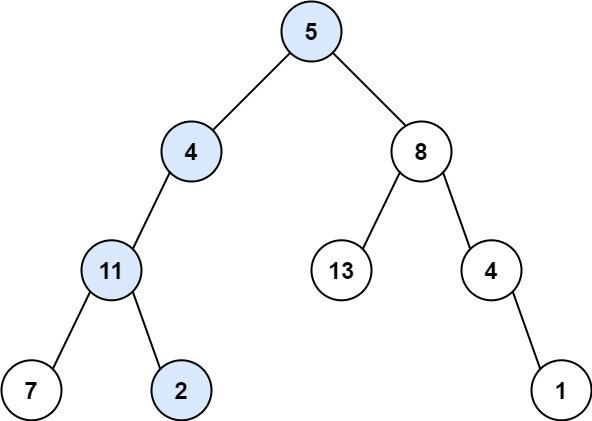

  - Input: root = [5,4,8,11,null,13,4,7,2,null,null,null,1], targetSum = 22

  - Output: true

  - Explanation: The root-to-leaf path with the target sum is shown.

- Example 2:

    - 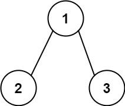

    - Input: root = [1,2,3], targetSum = 5

    - Output: false

    - Explanation: There two root-to-leaf paths in the tree: (1 --> 2): The sum is 3.

    - (1 --> 3): The sum is 4.

    - There is no root-to-leaf path with sum = 5.

- Example 3:
  
  - Input: root = [], targetSum = 0

  - Output: false

  - Explanation: Since the tree is empty, there are no root-to-leaf paths.
:::

```js
class Solution {
    public boolean hasPathSum(TreeNode root, int targetSum) {
        // 如果节点为空，无需判断
        if(root == null) return false;
        // 如果点前节点也就是叶子节点，并且值等于当前节点值，代表找到了路径
        if(root.left == null && root.right == null) {
            return root.val == targetSum;
        }
        // 否则向左找，需要减去已经访问的节点值
        boolean hasLeftPathSum = hasPathSum(root.left, targetSum - root.val);
        // 左边找到提前返回
        if(hasLeftPathSum) return true;
        // 否则向右找，需要减去已经访问的节点值
        return hasPathSum(root.right, targetSum - root.val);
    }
}
```

## 剑指 Offer 34. 二叉树中和为某一值的路径
:::tip
给你二叉树的根节点 root 和一个整数目标和 targetSum ，找出所有 从根节点到叶子节点 路径总和等于给定目标和的路径。叶子节点 是指没有子节点的节点。
- 示例 1：
 - 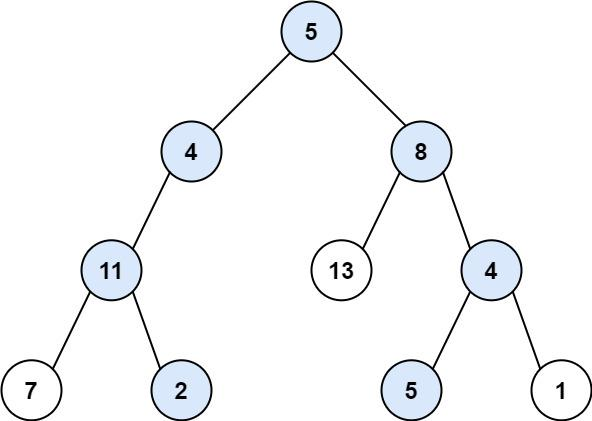
 - 输入：root = [5,4,8,11,null,13,4,7,2,null,null,5,1], targetSum = 22
 - 输出：[[5,4,11,2],[5,8,4,5]]
- 示例 2：
  - 
  - 输入：root = [1,2,3], targetSum = 5
  - 输出：[]
- 示例 3：
  - 输入：root = [1,2], targetSum = 0
  - 输出：[]
:::

```js
class Solution {
    // 返回的结果
    List<List<Integer>> result = new ArrayList<>();
    // 采集的路径
    Deque<Integer> path = new LinkedList<>();
    public List<List<Integer>> pathSum(TreeNode root, int target) {
        dfs(root, target);
        return result;
    }

    private void dfs(TreeNode node, int target) {
        if(node == null) return;
        // 先加进来再说
        path.offerLast(node.val);
        // 到达叶子节点
        if(node.left == null && node.right == null) {
            // 判断是否找到路径，找到加入结果集（采集完毕）
            if(node.val == target) result.add(new ArrayList<>(path));
        }
        dfs(node.left, target - node.val);
        dfs(node.right, target - node.val);
        // 回溯（backtracking）回溯的关键在于进入子函数前和子函数后要做对称操作
        path.pollLast();
    }
}
```

## 687. Longest Univalue Path
:::tip
Given the root of a binary tree, return the length of the longest path, where each node in the path has the same value. This path may or may not pass through the root.
The length of the path between two nodes is represented by the number of edges between them.
- Example 1:
  - 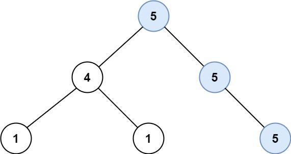
  - Input: root = [5,4,5,1,1,null,5]
  - Output: 2
  - Explanation: The shown image shows that the longest path of the same value (i.e. 5).
- Example 2:
  - 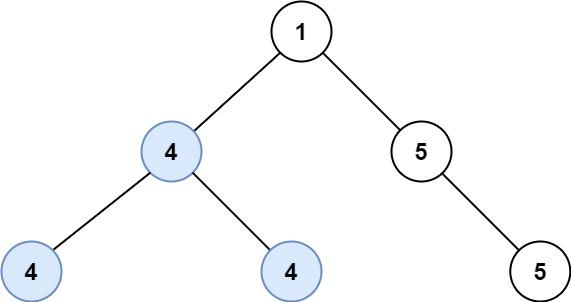
  - Input: root = [1,4,5,4,4,null,5]
  - Output: 2
  - Explanation: The shown image shows that the longest path of the same value (i.e. 4).
:::

```js
class Solution {
    int res = 0;
    public int longestUnivaluePath(TreeNode root) {
        dfs(root);
        return res;
    }

    private int dfs(TreeNode node) {
        if(node == null) return 0;
        int left = dfs(node.left);
        int right = dfs(node.right);
        // 如果左边节点不为空，并且等于当前值
        if(node.left != null && node.left.val == node.val) {
            left ++; // 左边值加1
        }else {
            left = 0;// 左边数为空,或者值不等于当前值
        }
        // 如果右边节点不为空，并且等于当前值
        if(node.right != null && node.right.val == node.val) {
            right ++; // 右边值加1
        }else {
            right = 0; // 右边数为空，或者值不等于当前值
        }
        // 将最大的路径存储起来
        res = Math.max(res, left + right);
        // 这里为什么要取左右最大的？不理解
        return Math.max(left, right);
    }
}
```

## 106. Construct Binary Tree from Inorder and Postorder Traversal
:::tip
Given two integer arrays inorder and postorder where inorder is the inorder traversal of a binary tree and postorder is the postorder traversal of the same tree, construct and return the binary tree.
- Example 1:
  - 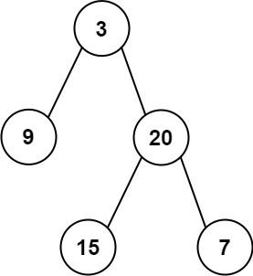
  - Input: inorder = [9,3,15,20,7], postorder = [9,15,7,20,3]
  - Output: [3,9,20,null,null,15,7]
- Example 2:
  - Input: inorder = [-1], postorder = [-1]
  - Output: [-1]
:::

Best Answer:https://leetcode.cn/problems/construct-binary-tree-from-inorder-and-postorder-traversal/solutions/50561/tu-jie-gou-zao-er-cha-shu-wei-wan-dai-xu-by-user72/
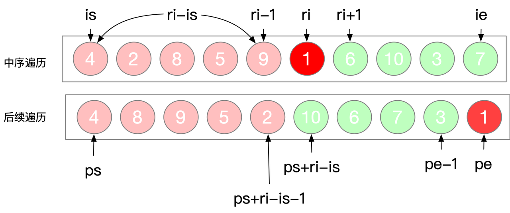
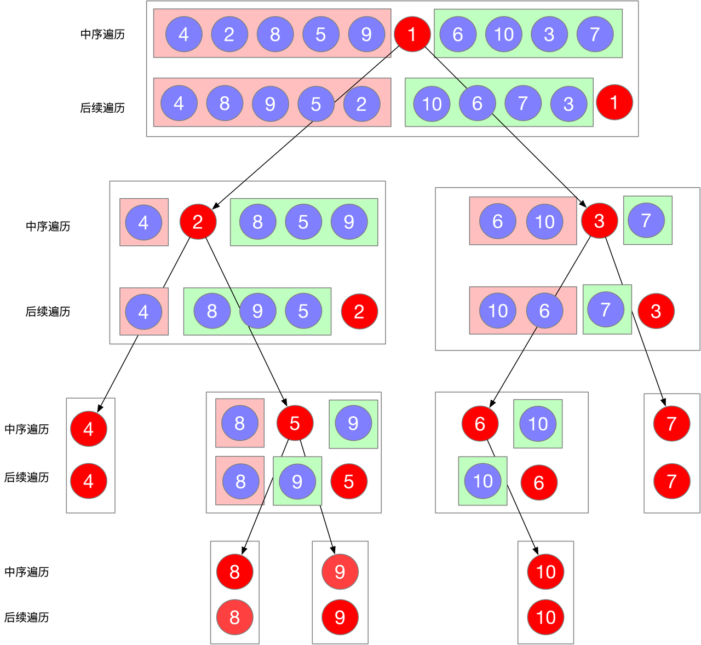

```js
class Solution {
    Map<Integer, Integer> map = null;
    public TreeNode buildTree(int[] inorder, int[] postorder) {
       map = new HashMap<>(inorder.length);
       // 存储value-index关系，后续获得O(1)查找复杂度
       for(int i = 0; i <inorder.length; i ++) map.put(inorder[i], i);
       return buildTree(inorder, 
                        postorder, 
                        0, 
                        inorder.length - 1, 
                        0, 
                        postorder.length - 1);
    }

    private TreeNode buildTree(int[] inorder, 
                               int[] postorder, 
                               int inLeft, 
                               int inRight, 
                               int postLeft, 
                               int postRight) {
        if(inLeft > inRight || postLeft > postRight) return null;
        // 取后续遍历最右边节点，便是根节点
        TreeNode root = new TreeNode(postorder[postRight]);
        // 查找中序遍历中的根节点
        // 因为是数组，需要O(n)复杂度去查找值，所有用map存val-index的对照关系
        int midIndex = map.get(postorder[postRight]);
        // 构建左子树
        // 中序遍历-边界
        int inLeft_1 = inLeft;
        int inRight_1 = midIndex - 1;
        // 后续遍历-边界
        int postLeft_1 = postLeft;
        // midIndex - inLeft是中序遍历左子树的节点个数
        int postRight_1 = postLeft + (midIndex - inLeft) - 1;
        root.left = buildTree(
            inorder, postorder, inLeft_1, inRight_1, postLeft_1, postRight_1
        );
        // 构建右子树
        // 中序遍历-边界
        int inLeft_2 = midIndex + 1;
        int inRight_2 = inRight;
        // 后续遍历-边界
        // inRight - midIndex是中序遍历的右子树的节点个数
        int postLeft_2 = postRight - (inRight - midIndex);
        int postRight_2 = postRight - 1;
        root.right = buildTree(
            inorder, postorder, inLeft_2, inRight_2, postLeft_2, postRight_2
        );
        return root;
    }
}
```

## 235. Lowest Common Ancestor of a Binary Search Tree
:::tip
Given a binary search tree (BST), find the lowest common ancestor (LCA) node of two given nodes in the BST.
According to the definition of LCA on Wikipedia: “The lowest common ancestor is defined between two nodes p and q as the lowest node in T that has both p and q as descendants (where we allow a node to be a descendant of itself).”
- Example 1:
  - 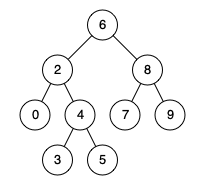
  - Input: root = [6,2,8,0,4,7,9,null,null,3,5], p = 2, q = 8
  - Output: 6
  - Explanation: The LCA of nodes 2 and 8 is 6.
- Example 2:
  - 
  - Input: root = [6,2,8,0,4,7,9,null,null,3,5], p = 2, q = 4
  - Output: 2
  - Explanation: The LCA of nodes 2 and 4 is 2, since a node can be a descendant of itself according to the LCA definition.
- Example 3:
  - Input: root = [2,1], p = 2, q = 1
  - Output: 2
:::

```js
class Solution {
    public TreeNode lowestCommonAncestor(TreeNode root, TreeNode p, TreeNode q) {
        if(root == null) return root;
        // 前提：BST
        // 当前节点值大于p也大于q，那说明p,q都在当前节点的左子树上
        // 去左子树上找
        if(root.val > p.val && root.val > q.val) {
            return lowestCommonAncestor(root.left, p, q);
        }
        // 当前节点值小于p也小于q，那说明p,q都在当前节点的右子树上
        // 去右子树上找
        if(root.val < p.val && root.val < q.val) {
            return lowestCommonAncestor(root.right, p, q);
        }
        // 能找到，就三种情况
        /* 
             root     p(root)    q(root)
             / \        /          /
           p    q      q          p
           
        */
        return root;
    }
}
```

## 236. Lowest Common Ancestor of a Binary Tree
:::tip
Given a binary tree, find the lowest common ancestor (LCA) of two given nodes in the tree.
According to the definition of LCA on Wikipedia: “The lowest common ancestor is defined between two nodes p and q as the lowest node in T that has both p and q as descendants (where we allow a node to be a descendant of itself).”
- Example 1:
  - 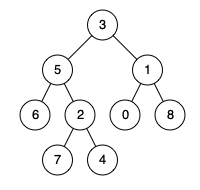
  - Input: root = [3,5,1,6,2,0,8,null,null,7,4], p = 5, q = 1
  - Output: 3
  - Explanation: The LCA of nodes 5 and 1 is 3.
- Example 2:
  - 
  - Input: root = [3,5,1,6,2,0,8,null,null,7,4], p = 5, q = 4
  - Output: 5
  - Explanation: The LCA of nodes 5 and 4 is 5, since a node can be a descendant of itself according to the LCA definition.
- Example 3:
  - Input: root = [1,2], p = 1, q = 2
  - Output: 1
:::
```js
class Solution {
    public TreeNode lowestCommonAncestor(TreeNode root, TreeNode p, TreeNode q) {
        // 如果p或q已经等于当前节点
        // p, q 必有一个是公共祖先
        if(root == null || root == p || root == q) return root;
        // 向左找
        TreeNode leftNode = lowestCommonAncestor(root.left, p, q);
        // 向右找
        TreeNode rightNode = lowestCommonAncestor(root.right, p, q);
        // 如果左右两边都不为空
        // 说明p,q分布在当前节点的两侧
        // 当前节点就是公共祖先
        if(leftNode != null && rightNode != null) return root;
        // 否则如果左侧不为空，右侧为空
        // 说明节点分布在左子树
        // 那当前节点就是公共祖先
        if(leftNode != null && rightNode == null) return leftNode;
        // 否则如果右侧不为空，左侧为空
        // 说明节点分布在右子树
        // 那当前节点就是公共祖先
        if(leftNode == null && rightNode != null) return rightNode;
        return null;
    }
}
```

## 剑指 Offer 32 - III. 从上到下打印二叉树 III
:::tip
请实现一个函数按照之字形顺序打印二叉树，即第一行按照从左到右的顺序打印，第二层按照从右到左的顺序打印，第三行再按照从左到右的顺序打印，其他行以此类推。
例如:
给定二叉树: [3,9,20,null,null,15,7],
    3
   / \
  9  20
    /  \
   15   7
返回其层次遍历结果：
[
  [3],
  [20,9],
  [15,7]
]
:::
```js
class Solution {
    public List<List<Integer>> levelOrder(TreeNode root) {
        List<List<Integer>> result = new ArrayList<>();
        if(root == null) return result;
        Queue<TreeNode> queue = new LinkedList<>();
        int level = 1;
        queue.offer(root);
        while(!queue.isEmpty()) {
            int size = queue.size();
            // 这里是关键，没想到，链表！！
            // 根据顺序，选择头插，还是尾插
            // 头插，就是倒序，尾插就是顺序
            LinkedList<Integer> linkedList = new LinkedList<>();
            for(int i = 0; i < size; i++) {
                TreeNode node = queue.poll();
                if(node == null) continue;
                if(level % 2 == 0) { // 如果是偶数行,从右到左
                    linkedList.addFirst(node.val);
                } else {
                    linkedList.addLast(node.val);
                }
                queue.offer(node.left);    
                queue.offer(node.right);
            }
            if(linkedList.size() > 0) result.add(linkedList);
            level ++;
        }
        return result;
    }
}
```

## 226. 翻转二叉树
:::tip
Given the root of a binary tree, invert the tree, and return its root.
- Example 1:
  - 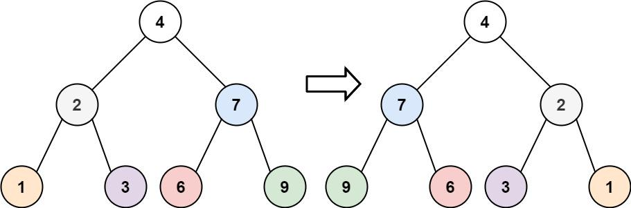
  - Input: root = [4,2,7,1,3,6,9]
  - Output: [4,7,2,9,6,3,1]
:::

```js
class Solution {
    public TreeNode invertTree(TreeNode root) {
        flip(root);
        return root;
    }

    private void flip(TreeNode node) {
        if(node == null) return;
        TreeNode temp = node.left;
        node.left = node.right;
        node.right = temp;
        flip(node.left);
        flip(node.right);
    }
}
```