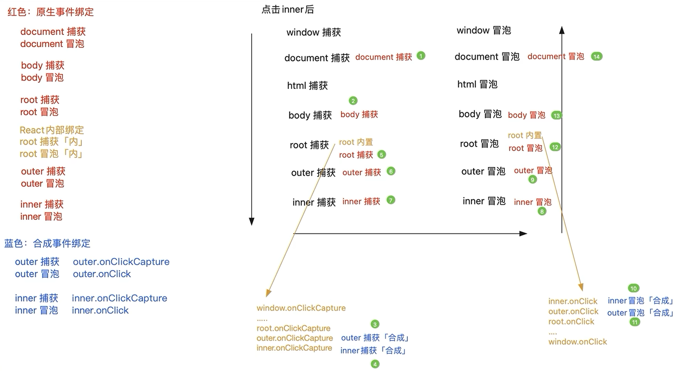

## React中的合成事件

```js
import React from "react"

class Demo extends React.Component {
  /**
   * 这种方式获取到的this=undefined
   */
  handle1() {
    console.log("this=", this)
  }
  /**
   * 经过bind处理，最后一个实参是合成事件对象SyntheticBaseEvent
   * 可以获得到nativeEvent，也就是原生事件对象
   * @param {*} param
   * @param {*} event
   */
  handle2(param, event) {
    console.log("param=", param)
    console.log("event=", event)
    console.log("this=", this)
  }
  /**
   * 箭头函数默认this就是Demo的上下文
   */
  handle3 = () => {
    console.log("this=", this)
  }
  /**
   * 当箭头函数需要传递额外参数时，也可以用bind
   * @param {*} param
   * @param {*} event
   */
  handle4 = (param, event) => {
    console.log("param=", param)
    console.log("event=", event)
    console.log("this=", this)
  }
  render() {
    return (
      <div>
        <button onClick={this.handle1}>
            这种方式获取到的this=undefined
        </button>
        

        <button onClick={this.handle2.bind(this, { x: 1 })}>
            绑定this上下文，经过bind处理，最后一个实参是合成事件对象
        </button>
        

        <button onClick={this.handle3}>
            箭头函数默认this就是Demo的上下文
        </button>
        
        
        <button onClick={this.handle4.bind(this, { y: 1 })}>
            当箭头函数需要传递额外参数时，也可以用bind
        </button>
      </div>
    )
  }
}

export default Demo
```

## javascript中的事件绑定与冒泡
```js
<!DOCTYPE html>
<html lang="en">
  <head>
    <meta charset="UTF-8" />
    <meta http-equiv="X-UA-Compatible" content="IE=edge" />
    <meta name="viewport" content="width=device-width, initial-scale=1.0" />
    <title>event</title>
    <style>
      .layer1 {
        width: 300px;
        height: 300px;
        background-color: blue;
        display: flex;
        align-items: center;
        justify-content: center;
      }
      .layer2 {
        width: 200px;
        height: 200px;
        margin: 20px;
        background-color: aquamarine;
        display: flex;
        align-items: center;
        justify-content: center;
      }
      .layer3 {
        width: 100px;
        height: 100px;
        margin: 20px;
        background-color: red;
      }
    </style>
  </head>
  <body>
    <div class="layer1">
      <div class="layer2">
        <div class="layer3"></div>
      </div>
    </div>
  </body>
  <script>
    /**
      *  执行顺序:
      *  demo5.html:69 layer1 捕获
      *  demo5.html:57 layer2 捕获
      *  demo5.html:45 layer3 捕获
      *  demo5.html:51 layer3 冒泡
      *  demo5.html:63 layer2 冒泡
      *  demo5.html:75 layer1 冒泡
      */
    document.querySelector(".layer3").addEventListener(
      "click",
      () => {
        console.log("layer3 捕获")
      },
      true
    )

    document.querySelector(".layer3").addEventListener("click", () => {
      console.log("layer3 冒泡")
    })

    document.querySelector(".layer2").addEventListener(
      "click",
      () => {
        console.log("layer2 捕获")
      },
      true
    )

    document.querySelector(".layer2").addEventListener("click", () => {
      console.log("layer2 冒泡")
    })

    document.querySelector(".layer1").addEventListener(
      "click",
      () => {
        console.log("layer1 捕获")
      },
      true
    )

    document.querySelector(".layer1").addEventListener("click", (event) => {
      console.log("layer1 冒泡")
      // 阻止事件传播，在当前层级后，全部阻止
      // 当前层级对象绑定的多个事件都会执行
      event.stopPropagation()
      // 阻止事件传播，在当前层级后，全部阻止
      // 当前层级对象绑定多个事件只有这个会执行，其他不执行
      event.stopImmediatePropagation()
    })
  </script>
</html>
```

## javascript中的事件委托
:::tip

- 事件委托:只需要给容器做一个事件绑定点击内部的任何元素，根据事件的冒泡传播机制，都会让容器的点击事件也触发;我们在这里，根据事件源，做不同的事情就可以了
- 提高JS代码运行的性能，并且把处理的逻辑都集中在一起!!
- 但是mouseenter/ouseleave等事件是没有冒泡传播机制的，无法这么使用
  
:::  
```js
  const body = document.body
  body.addEventListener("click", function (ev) {
    // ev.target:事件源 点击的是谁，谁就是事件源
    let target = ev.target
    let { id } = target
    if (id === "root") {
      console.log(" root")
      return
    }
    if (id === "outer") {
      console.log("outer")
      return
    }
    if (id === "inner") {
      console.log("inner")
      return
    }
    // 如果以上都不是，我们处理啥....
  })
```


## React17+版本合成事件原理
:::tip
- 在React17版本以后，事件委托给了#root
- 在#root捕获阶段和冒泡阶段分别执行合成事件
:::




## React17之前版本合成事件原理
:::tip
- 在React17版本之前，事件委托给了document
- 合成事件的捕获和冒泡阶段的事件，同时在document的原生点击事件的冒泡阶段被同时执行
:::


