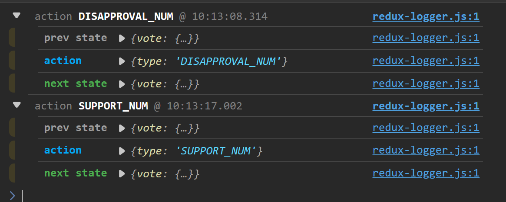

:::tip
在 dispatch 调用之前，做一些前置处理
:::

## redux-logger

:::tip
打印日志
:::

```js
import { createStore, applyMiddleware } from "redux"
import reducer from "./reducer"
// redux-logger需要单独安装
import reduxLogger from "redux-logger"
// 传入第二个参数，将所有中间件注入到createStore方法中
// applyMiddleware(middleware1, middleware2, ...)
const store = createStore(reducer, applyMiddleware(reduxLogger))

export default store
```



## redux-thunk

:::tip
支持 dispatch action 异步操作
:::

```js title="store.js"
import { createStore, applyMiddleware } from "redux"
import reducer from "./reducer"
import reduxLogger from "redux-logger"
// 导入redux-thunk 而不是 reduxThunk
import { thunk } from "redux-thunk"

const store = createStore(reducer, applyMiddleware(thunk, reduxLogger))

export default store
```

```js title="xxx.action.js"
/**
 * 模拟异步执行返回promise
 *
 * @param {*} mileseconds
 * @returns
 */
const wait = (mileseconds = 1000) => {
  return new Promise((resolve) => {
    setTimeout(() => {
      resolve()
    }, mileseconds)
  })
}

const VoteAction = {
  support() {
    // 返回一个异步函数
    return async (dispatch) => {
      await wait()
      // 这里要用dispatch分发action
      dispatch({
        type: Types.SUPPORT_NUM
      })
    }
  }
  // ...
}
// ...
```

## redux-promise

```js title="store.js"
import { createStore, applyMiddleware } from "redux"
import reducer from "./reducer"
import reduxLogger from "redux-logger"
// 导入redux-promise
import reduxPromise from "redux-promise"
// 使用redux-promise
const store = createStore(reducer, applyMiddleware(reduxPromise, reduxLogger))

export default store
```

```js title="xx.action.js"
/**
 * 模拟异步执行返回promise
 *
 * @param {*} mileseconds
 * @returns
 */
const wait = (mileseconds = 1000) => {
  return new Promise((resolve) => {
    setTimeout(() => {
      resolve()
    }, mileseconds)
  })
}

const VoteAction = {
  // redux-promise直接使用async标识方法
  async support() {
    await wait()
    return {
      type: Types.SUPPORT_NUM
    }
  }
  // ...
}
// ...
```
