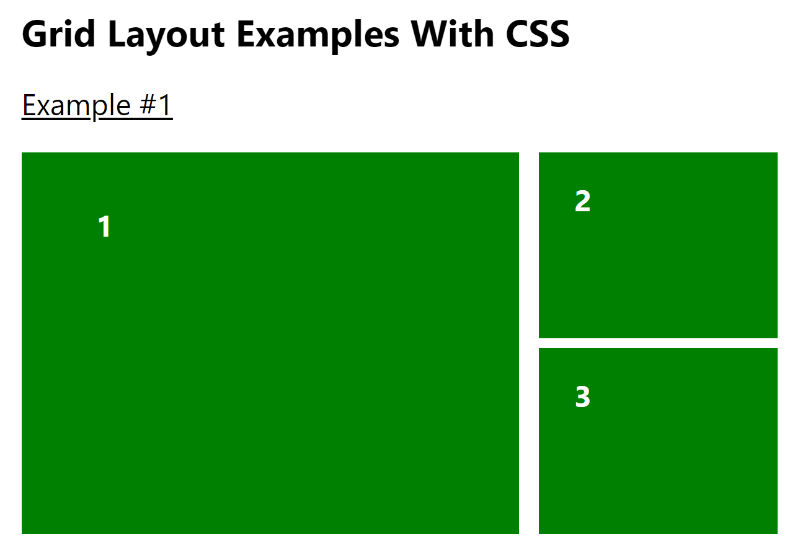

```js
import "./GridLayout.css"

function GridLayoutWithCss() {
  return (
    <>
      <div className="mx-auto p-8 w-full lg:w-1/2">
        <h1 className="text-3xl font-bold">Grid Layout Examples With CSS</h1>
        <h2 className="my-6 text-2xl underline underline-offset-2">
          Example #1
        </h2>
        <div
          style={{
            display: "grid",
            gap: "8px 16px", // 同 columnGap和rowGap
            gridColumn: 3,
            gridRow: 2,
            // columnGap: "16px",
            // rowGap: "8px",
            gridTemplateColumns: "1fr 1fr 1fr", // 平均分，如果是2fr 1fr 1fr就是平均分为4份，第一份占2个长度
            gridTemplateRows: "1fr 1fr"
          }}
        >
          <div
            className="box"
            style={{
              gridRowStart: "1", // 从第一行开始
              gridRowEnd: "span 2", // 横跨两行
              // gridRow: "1/ span 2",
              gridColumnStart: "1", // 从第一列开始
              gridColumnEnd: "span 2" // 横跨两列
              // gridColumn: "1 / span 2" // 从第一列开始，横跨2列
              // gridColumn: "1 / 3" // 从第一列开始，到第三列之前合并，不包含第三列
              // grid-area: 1 / 1 / span 2 / span 2 // 合并写法
            }}
          >
            1
          </div>
          <div className="box">2</div>
          <div className="box">3</div>
        </div>
      </div>
    </>
  )
}

function GridLayoutWithTailWind() {
  return (
    <>
      <div className="mx-auto p-8 w-full lg:w-1/2">
        <h1 className="text-3xl font-bold">
          Grid Layout Examples With Tailwind
        </h1>
        <h2 className="my-6 text-2xl underline underline-offset-2">
          Example #2
        </h2>
        <div className="grid grid-cols-3 grid-rows-2 gap-x-4 gap-y-2">
          <div className="box row-span-2 col-span-2">1</div>
          <div className="box">2</div>
          <div className="box">3</div>
        </div>
      </div>
    </>
  )
}

export default function GridLayout() {
  return (
    <div className="w-full grid grid-rows-1 grid-cols-1 gap-x-2">
      <GridLayoutWithCss />
      <GridLayoutWithTailWind />
    </div>
  )
}
```